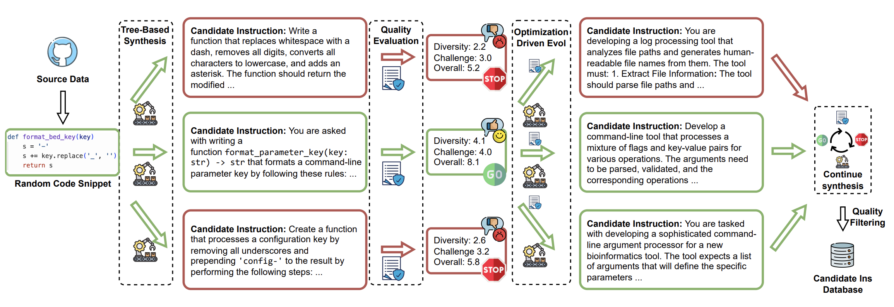
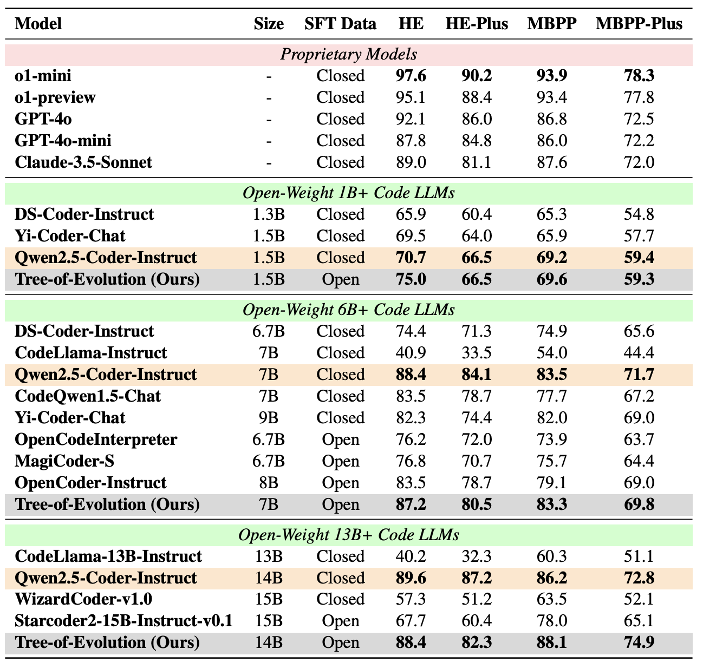
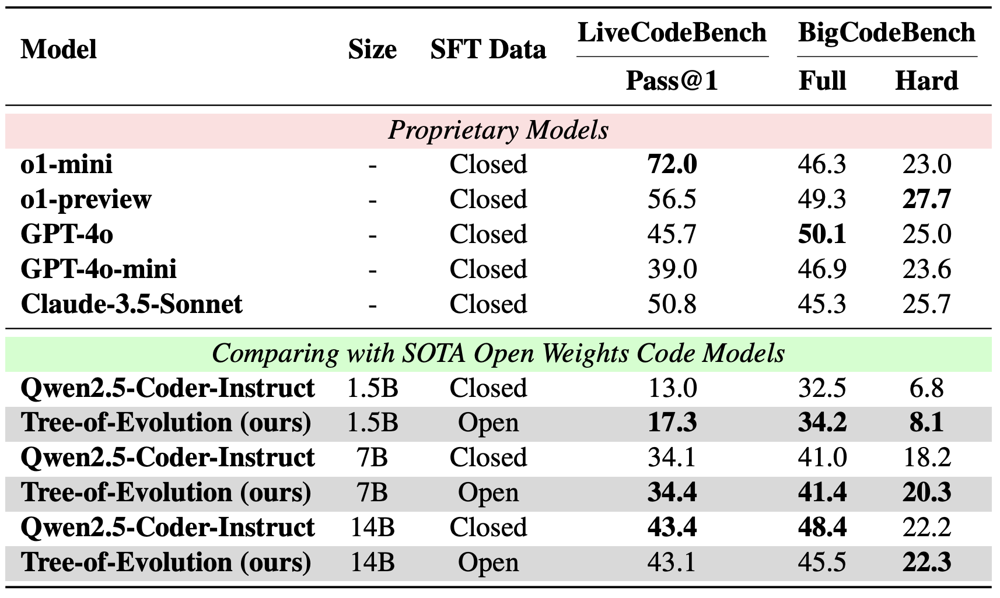

<div align="center">

# Tree-of-Evolution: Tree-Structured Instruction Evolution for Code Generation in Large Language Models

[](https://arxiv.org/abs/2411.13281)
[](LICENSE)
[](https://www.python.org/)
[](https://pytorch.org/)
[](https://huggingface.co/datasets/CodeResearch/tree-of-evol-75k)
[](https://huggingface.co/CodeResearch)

**A novel framework for synthesizing high-quality code instruction data through tree-structured evolution**

---

</div>

## 📋 Abstract

Data synthesis has become a crucial research area in large language models (LLMs), especially for generating high-quality instruction fine-tuning data to enhance downstream performance. In code generation, a key application of LLMs, manual annotation of code instruction data is costly. 

Recent methods, such as Code Evol-Instruct and OSS-Instruct, leverage LLMs to synthesize large-scale code instruction data, significantly improving LLM coding capabilities. However, these approaches face limitations due to **unidirectional synthesis** and **randomness-driven generation**, which restrict data quality and diversity.

To overcome these challenges, we introduce **Tree-of-Evolution (ToE)**, a novel framework that:

- 🌳 **Models code instruction synthesis with tree structures** - exploring multiple evolutionary paths
- 🎯 **Uses optimization-driven evolution** - refining each generation based on previous iteration quality  
- 📊 **Achieves superior performance** - base models fine-tuned on just 75k synthesized samples match state-of-the-art performance

**Results**: Our method achieves comparable or superior performance to Qwen2.5-Coder-Instruct (trained on millions of samples) across five coding benchmarks: HumanEval, MBPP, EvalPlus, LiveCodeBench, and BigCodeBench.

<div align="center">



*Figure 1: Tree-of-Evolution Framework Overview*

</div>

## 🚀 Quick Start

### 📦 Released Resources

We provide the following resources for the community:

| Resource | Description | Link |
|----------|-------------|------|
| **Dataset** | Tree-of-Evol-75k: High-quality synthesized code instruction data | [🤗 HuggingFace](https://huggingface.co/datasets/CodeResearch/tree-of-evol-75k) |
| **Model (1.5B)** | Qwen2.5-Coder-1.5B-Base fine-tuned on Tree-of-Evol-75k | [🤗 HuggingFace](https://huggingface.co/CodeResearch/tree-of-evol-1.5b) |
| **Model (7B)** | Qwen2.5-Coder-7B-Base fine-tuned on Tree-of-Evol-75k | [🤗 HuggingFace](https://huggingface.co/CodeResearch/tree-of-evol-7b) |
| **Model (14B)** | Qwen2.5-Coder-14B-Base fine-tuned on Tree-of-Evol-75k | [🤗 HuggingFace](https://huggingface.co/CodeResearch/tree-of-evol-14b) |


### 🔧 Installation

```bash
git clone https://github.com/CodeLLM-Research/Tree-of-Evolution.git
cd Tree-of-Evolution
pip install -r requirements.txt
```

This will clone the repository and install all necessary dependencies.

### ⚙️ Configuration

**Important**: Before running the framework, you need to set up your API keys:

1. Copy the sample environment file:
   ```bash
   cp .env.sample .env
   ```

2. Edit the `.env` file and add your API keys:
   ```bash
   # OpenAI API Key (required for instruction synthesis and complexity scoring)
   OPENAI_API_KEY=your_openai_api_key_here
   
   # Add other API keys as needed
   ```

3. Make sure to keep your `.env` file secure and never commit it to version control.

**Note**: The framework requires valid API keys to function properly. Without proper configuration, the synthesis and scoring modules will fail.

## 📝 Usage

The Tree-of-Evolution framework generates high-quality code instruction data through tree-structured evolution. Here's how to use the three main components:

### 1. Instruction Synthesis (`instruction_synthesis.py`)

This is the core module that generates evolved instructions using the tree-structured approach with complexity and diversity guidance.

```bash
PYTHONPATH=. python src/instruction_synthesis.py \
    --input_path data/seed.function.5k.json \
    --output_dir data/round1_synthesis \
    --model_name gpt-4o \
    --num_threads 10 \
    --temperature 1.0 \
    --max_tokens 2048 \
    --opt_evo # Use optimization-driven evolution. For the first round, we do not have previously generated samples, so we should not use this flag.
```

**Parameters:**
- `--input_path`: Path to input JSON file (with complexity and diversity scores)
- `--output_dir`: Directory to store synthesis results
- `--model_name`: LLM model for instruction synthesis (default: gpt-4o)
- `--num_threads`: Number of parallel threads (default: 4)
- `--temperature`: Temperature for creative synthesis (default: 0.7)
- `--max_tokens`: Maximum tokens in response (default: 4096)
- `--opt_evo`: Use optimization-driven evolution. For the first round, we do not have previously generated samples, so we should not use this flag.

**Input Format:**
```json
[
  {
    "id": "1",
    "content": "Write a Python function to calculate factorial...",
    "self complexity score": 7.5,
    "self diversity score": 0.8
  }
]
```

**How it works:**
- For root samples (ID like "1"): Uses only the content to generate evolved instructions
- For child samples (ID like "1_2"): Uses content + complexity/diversity scores to guide evolution
- Creates tree-structured evolution paths with multiple generations

### 2. Complexity Scoring (`complexity_scoring.py`)

This supporting module evaluates the complexity of programming questions using LLM-based judgment. It's used to prepare data for instruction synthesis.

**Basic Usage:**
```bash
PYTHONPATH=. python src/complexity_scoring.py \
    --input_path data/round1_synthesis/all_synthesized_instructions.json \
    --output_dir data/round1_complexity \
    --model_name gpt-4o \
    --num_threads 10 \
    --temperature 0.0 \
    --max_tokens 2048
```

**Parameters:**
- `--input_path`: Path to input JSON file containing programming questions
- `--output_dir`: Directory to store complexity scoring results
- `--model_name`: LLM model to use for complexity evaluation (default: gpt-4o)
- `--num_threads`: Number of parallel threads for processing (default: 4)
- `--temperature`: Temperature for LLM response (default: 0.0)
- `--max_tokens`: Maximum tokens in response (default: 2048)

**Input Format:**
```json
[
  {
    "id": "1",
    "content": "Write a Python function to calculate factorial..."
  }
]
```

**Output:** Individual `.jsonl` files for each question and a summary file with complexity scores (1-10 scale).

### 3. Diversity Scoring (`diversity_scoring.py`)

This supporting module calculates diversity scores by measuring semantic similarity between samples. It complements complexity scoring to guide instruction synthesis.

**Basic Usage:**
```bash
PYTHONPATH=. python src/diversity_scoring.py \
    --input_path data/round1_complexity/all_questions_w_complexity_scores.json \
    --output_path data/round1_diversity/questions_w_diversity_scores.json \
    --model_name "Alibaba-NLP/gte-large-en-v1.5" \
    --batch_size 10 \
    --device "auto"
```

**Parameters:**
- `--input_path`: Path to complexity scoring results JSON file
- `--output_path`: Path to save diversity scoring results
- `--model_name`: Sentence transformer model for embeddings (default: Alibaba-NLP/gte-large-en-v1.5)
- `--batch_size`: Batch size for embedding computation (default: 32)
- `--device`: Device for computation (auto/cuda/mps/cpu, default: auto)

**Note:** For Apple Silicon Macs, use `--device cpu` if you encounter segmentation faults with MPS.

### Complete Pipeline Example

Here's how to run the complete Tree-of-Evolution pipeline for generating high-quality code instruction data:

#### 🔄 Multi-Round Evolution Process

**Round 1: Initial Evolution (from seed data)**

```bash
# Step 1: Synthesize evolved instructions from seed data (without --opt_evo for first round)
PYTHONPATH=. python src/instruction_synthesis.py \
    --input_path data/seed.function.5k.json \
    --output_dir data/round1_synthesis \
    --model_name gpt-4o \
    --num_threads 10 \
    --temperature 1.0 \
    --max_tokens 2048

# Step 2: Score complexity of synthesized instructions
PYTHONPATH=. python src/complexity_scoring.py \
    --input_path data/round1_synthesis/all_synthesized_instructions.json \
    --output_dir data/round1_complexity \
    --model_name gpt-4o \
    --num_threads 10 \
    --temperature 0.0

# Step 3: Calculate diversity scores
PYTHONPATH=. python src/diversity_scoring.py \
    --input_path data/round1_complexity/all_questions_w_complexity_scores.json \
    --output_path data/round1_diversity/questions_w_diversity_scores.json \
    --model_name "Alibaba-NLP/gte-large-en-v1.5" \
    --batch_size 10 \
    --device auto
```

**Round 2: Optimization-Driven Evolution (from Round 1 results)**

```bash
# Step 4: Synthesize with optimization-driven evolution (now use --opt_evo)
PYTHONPATH=. python src/instruction_synthesis.py \
    --input_path data/round1_diversity/questions_w_diversity_scores.json \
    --output_dir data/round2_synthesis \
    --model_name gpt-4o \
    --num_threads 10 \
    --temperature 1.0 \
    --max_tokens 2048 \
    --opt_evo

# Step 5: Score complexity of Round 2 synthesized instructions
PYTHONPATH=. python src/complexity_scoring.py \
    --input_path data/round2_synthesis/all_synthesized_instructions.json \
    --output_dir data/round2_complexity \
    --model_name gpt-4o \
    --num_threads 10 \
    --temperature 0.0

# Step 6: Calculate diversity scores for Round 2
PYTHONPATH=. python src/diversity_scoring.py \
    --input_path data/round2_complexity/all_questions_w_complexity_scores.json \
    --output_path data/round2_diversity/questions_w_diversity_scores.json \
    --model_name "Alibaba-NLP/gte-large-en-v1.5" \
    --batch_size 10 \
    --device auto
```

**Continue for additional rounds as needed...**

#### 📊 Expected Data Flow

```
Seed Data (5k samples)
    ↓ [Instruction Synthesis - Round 1]
Evolved Instructions (~15k samples)
    ↓ [Complexity Scoring]
Complexity Scores (1-10 scale)
    ↓ [Diversity Scoring]
Diversity Scores (0-1 scale)
    ↓ [Instruction Synthesis - Round 2 with --opt_evo]
Further Evolved Instructions (~45k samples)
    ↓ [Complexity + Diversity Scoring]
Scored Instructions for next round
    ↓ [Continue rounds...]
Final Dataset (75k+ high-quality samples)
```

For each round, we apply quality thresholds based on complexity and diversity scores to filter out low-quality samples, ensuring only the most challenging and diverse instructions proceed to the next evolution cycle.


## 📈 Performance


<div align="center">


*HumanEval and MBPP Performance Comparison*


*LiveCodeBench and BigCodeBench Performance Comparison*

</div>


## 📄 License

This project is licensed under the Apache License 2.0 - see the [LICENSE](LICENSE) file for details.

## 📖 Citation

If you find this work useful, please cite our paper:

```bibtex
@inproceedings{luo2025tree,
    title={Tree-of-Evolution: Tree-Structured Instruction Evolution for Code Generation in Large Language Models},
    author={Ziyang Luo, Kaixin Li, Hongzhan Lin, Yuchen Tian, Mohan Kankanhalli, Jing Ma},
    booktitle={Proceedings of the 63rd Annual Meeting of the Association for Computational Linguistics (ACL)},
    year={2025}
}
```